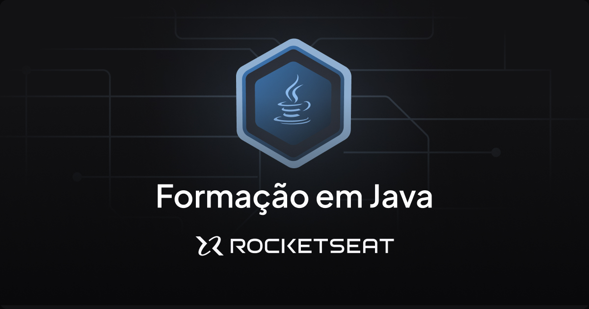

# Ignite | Job Management



Welcome to the Job Management project! This application is designed to facilitate job management, developed as part of [Rocketseat's Java](https://app.rocketseat.com.br/) course.

## Introduction

The Ignite Job Management project is an outcome of Rocketseat's Java course, aimed at providing a comprehensive solution for vacancy management. Whether you are a participant in the course or a developer interested in job management systems, this project serves as a practical application of Spring Boot and Java 17.

## Features

## Getting Started

### Prerequisites

Before you begin, ensure you have the following prerequisites installed on your machine:

* Java 17
* Maven
* Docker

### Database Setup

To set up the `PostgreSQL` database, use the provided `Docker Compose` configuration:

```yaml
version: '3.8'

services:
  postgres:
    container_name: gestao-vagas-postgres
    image: postgres
    ports:
      - 5432:5432
    environment:
      - POSTGRES_USER=admin
      - POSTGRES_PASSWORD=admin
      - POSTGRES_DB=gestaovagas
```

Execute the following commands in your docker image:

```bash
docker-compose up -d
```

To access the database, execute the commands:

```bash
docker exec -it gestao-vagas-postgres bash
```

```bash
psql -U admin -d gestaovagas
```

### Running the Application

To run the Ignite Job Management application, use your favorite IDE or execute the following command in the project root:

```bash
mvnw spring-boot:run
```

The application will be accessible at [http://localhost:8081](http://localhost:8081).

## Usage

To access examples of routes and uses, access the `routes.http` file.

## Acknowledgements

I thank [Rocketseat](https://app.rocketseat.com.br/) and the teachers for their excellence in classes, which have been fundamental to my professional growth. The quality of the content provided is a constant source of inspiration. Thank you very much!

